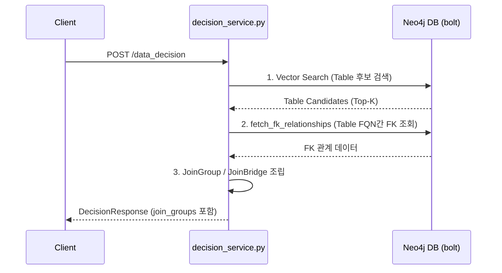

# robo-meta-api 외래키(FK) 경로 탐색 추가 반영 계획 및 API 영향 검토

본 문서는 `robo-meta-api` 서비스의 `/data_decision` 파이프라인에 KAIR NLQ 서비스와 동일한 외래키(FK) 그래프 기반 연관 테이블 확장 기능을 반영하기 위한 기술 설계 및 API 스펙 영향 분석을 다룹니다.

---

## 1. 반영 목적
*   **RAG 품질 향상**: 단순 벡터 검색으로 선택된 테이블뿐만 아니라, 이들과 외래키(FK) 관계로 긴밀하게 결합된 연관 테이블들을 그래프 탐색으로 탐지하여 프롬프트 컨텍스트 스키마에 포함시킵니다.
*   **조인 경로 제공**: 최종 사용자나 SQL 생성 모듈이 테이블 간 조인할 수 있는 외래키 매핑 정보(`JoinGroup`)를 응답으로 제공합니다.

---

## 2. 세부 반영 계획 (Implementation Plan)

### 2.1 1단계: 내장된 Neo4j FK 쿼리 함수 활성화
*   `robo-meta-api/app/services/neo4j_client/vector_search.py` 내에는 이미 KAIR 원본 쿼리에서 포팅된 `fetch_fk_relationships` 비동기 함수가 구현되어 있습니다.
*   이 함수는 Neo4j의 `:HAS_COLUMN`, `-[fk:fkTo]->`, `:Table`을 매칭하여 전달된 테이블 FQN 리스트 간의 외래키 엣지를 고스란히 긁어옵니다.

### 2.2 2단계: 서비스 비즈니스 레이어(`decision_service.py`) 연동
*   `robo-meta-api/app/services/decision_service.py`의 `decide` 함수 내에서 1차 벡터 매칭을 통해 획득한 상위 테이블 후보군(`candidates`)의 FQN 목록(`[f"{schema}.{name}" for t in candidates]`)을 추출합니다.
*   FQN 목록을 `fetch_fk_relationships`에 전달하여 외래키 릴레이션 데이터를 획득합니다.

### 2.3 3단계: JoinGroup 및 JoinBridge 구조화
*   획득한 FK 관계 데이터(from_table, from_column, to_table, to_column, constraint_name)를 가공하여, `JoinGroup` 과 `JoinBridge` 인스턴스 배열을 조립합니다.
*   조립된 목록을 `DecisionResponse` 의 `join_groups` 필드에 주입하여 최종 응답으로 반환합니다.

---

## 3. API 엔드포인트 및 바디 영향도 모의 검토

기존의 `/data_decision` API를 활용하고 있는 외부 클라이언트와의 통신 규격을 바탕으로 한 모의 검토 결과입니다.

| 검토 영역 | 영향 여부 | 분석 상세 및 하위 호환성 여부 |
| :--- | :---: | :--- |
| **Endpoint Path** | **영향 없음** | 기존 엔드포인트 경로인 `POST /data_decision`을 그대로 유지합니다. 클라이언트 사이드에서 호출 URL을 변경할 필요가 없습니다. |
| **Request Body** | **영향 없음** | 입력 파라미터 규격인 `DecisionRequest` (`query`, `include_matched_columns`, `column_top_m`, `auto_resolve_entities`) 구조를 일체 수정하지 않습니다. 따라서 클라이언트의 호출 데이터 스펙에 대한 수정이 불필요합니다. |
| **Response Body** | **영향 없음 (100% 호환)** | 기존 `/data_decision` 응답 스키마인 `DecisionResponse` 내부에는 이미 **`join_groups: List[JoinGroup] = Field(default_factory=list)`** 필드가 구현되어 있습니다.  기존에는 기능 미반영으로 인해 빈 배열(`[]`)로 반환되던 하위 JSON 필드에 실제 데이터가 채워지는 구조적 변화만 발생하므로, JSON 규격(스키마 구조)이 깨지지 않아 **기존 클라이언트 서비스에 무결(100% 하위 호환)** 합니다. |

> [!TIP]
> 내부 로직에서 FK 그래프 탐색을 수행하고 `join_groups` 데이터를 채워주기만 하면, 통신 포맷이나 엔드포인트 수정 같은 아키텍처적 깨짐(Breaking Changes) 없이 안전하게 기능을 포팅할 수 있습니다.
