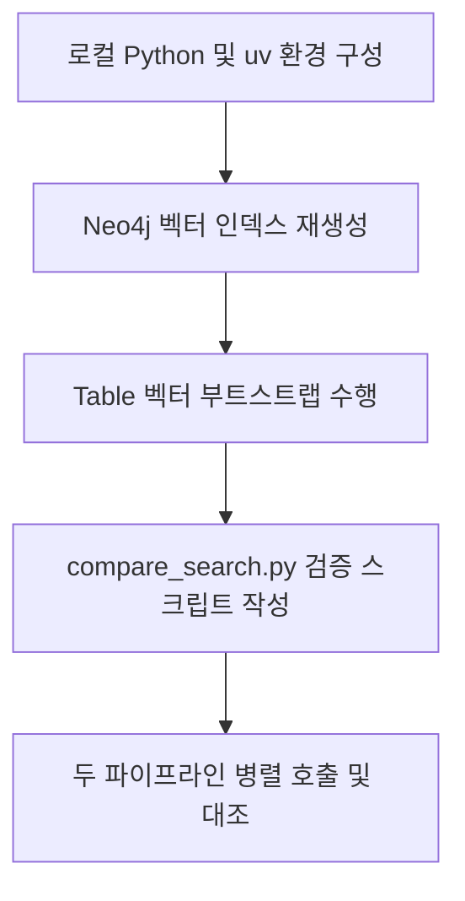

# K-AIR NLQ vs robo-meta-api RAG 검색 비교 검증 보고서

본 보고서는 **K-AIR Text2SQL(NLQ)** 서비스의 RAG 파이프라인(`build_sql_context`)과 **robo-meta-api**의 `/data_decision` API가 동일한 Neo4j 그래프 데이터베이스를 참조하고 있는지, 그리고 HyDE(가상 스키마) 기반 검색 로직이 동일하게 적용되고 있는지를 비교 검증한 과정을 기술합니다.

---

## 1. 검증 개요

*   **검증 질의**: `"유역본부 내 정수장별 공급량은?"`
*   **검증 대상**:
    1.  **robo-meta-api**의 `POST /data_decision` 엔드포인트
    2.  **K-AIR Text2SQL**의 `build_sql_context` (Mock `ToolContext` 활용 내부 로직 호출)
*   **핵심 목적**:
    *   두 서비스가 동일한 Neo4j 인스턴스를 바라보고 정상 동작하는가?
    *   두 서비스의 HyDE 검색 및 스키마 선별 결과가 의미적으로 일치하는가?
    *   선별 결과에 차이가 존재한다면 그 기술적인 원인은 무엇인가?

---

## 2. 검증 수행 과정

검증을 위해 로컬 개발 환경에서 다음과 같은 단계별 작업을 수행하였습니다.

### 2.1 로컬 파이썬 및 uv 환경 준비
1.  로컬 PC에 Python 3.13.14 설치 및 재기동을 확인하였습니다.
2.  전역 설치 없이 실행할 수 있도록 `pip install uv`를 통해 파이썬 패키지 매니저 `uv`를 설치하였습니다.
3.  `KAIR/neo4j-text2sql` 하위 디렉토리에서 `python -m uv sync`를 수행하여 가상환경(`.venv`) 내에 필수 의존성 라이브러리(`langchain`, `neo4j`, `openai`, `pydantic` 등)를 정상 배치하였습니다.

### 2.2 Neo4j 벡터 인덱스 정상화
Neo4j 데이터베이스 내부 조사 결과, 벡터 인덱스명들이 시스템 난수 형태(`index_UUID`)로 기재되어 있어 KAIR RAG 쿼리 수행 시 에러를 유발하였습니다. 이에 기존 인덱스를 삭제하고 표준화된 규격 명칭으로 재선언하였습니다.
*   **삭제된 인덱스**: `index_5dff40cd`, `index_d11983c6`, `index_ed8fb9e0`, `index_e648a053`, `index_a1832485`
*   **생성된 인덱스**:
    *   `table_vec_index` (Table.vector)
    *   `text_to_sql_table_vec_index` (Table.text_to_sql_vector)
    *   `column_vec_index` (Column.vector)
    *   `query_question_vec_index` (Query.vector_question)
    *   `query_intent_vec_index` (Query.vector_intent)

### 2.3 테이블 벡터 임베딩 생성 (부트스트랩)
Neo4j의 `Table` 노드에 RAG 검색의 키가 되는 `text_to_sql_vector` 프로퍼티가 비어있음을 확인하였습니다 (`Table with text_to_sql_vector count = 0`).
*   KAIR의 `ensure_text_to_sql_table_vectors` 모듈을 로컬에서 연동하여, 로컬 PostgreSQL 컨테이너(`5434` 포트)의 실제 데이터를 샘플링 후 LLM(`gpt-4o-mini`)을 통해 테이블 프로파일링을 진행하였습니다.
*   생성된 텍스트를 임베딩 벡터로 변환하여 Neo4j의 33개 핵심 테이블 노드에 벡터 정보를 완벽히 적재하였습니다.

### 2.4 비교 테스트 코드 작성 및 실행
*   `.test/compare_search.py` 스크립트를 작성하였습니다.
*   Windows 터미널(cp949) 한글 인코딩 깨짐을 막기 위해 `sys.stdout`을 UTF-8로 강제 재설정하는 코드를 가미하였습니다.
*   `python -m uv run --project KAIR/neo4j-text2sql python .test/compare_search.py` 명령으로 두 RAG 결과를 정상적으로 추출 및 파싱하였습니다.

---

## 3. 검증 결과 대조

두 서비스에 동일한 자연어 질의 `"유역본부 내 정수장별 공급량은?"`을 보냈을 때 선별한 테이블 정보는 아래와 같습니다.

| 분류 | robo-meta-api (10개 선별) | KAIR Text2SQL RAG (20개 선별) |
| :--- | :--- | :--- |
| **선택 테이블 목록** | `krf_catchment` `data_source` `watershed_topo_face_map` `weather_sources` `facility_reach_mapping` `river_routing_v2` `krf_topology` `weather_stations` `weather_collection_log` `krf_reach` | `public.facility_topo_map` `public.facility_reach_mapping` `public.scada_readings` `public.watershed_major/medium/small` `public.krf_catchment` `public.krf_reach` `public.krf_node` `public.river_topo_node/edge_map` `public.krf_topology` `public.river_routing/v2/v3` `public.river_routing_vertices_pgr` `public.watershed_topo_face_map` `public.dam_locations` `public.weir_locations` `public.krf_node_int_map` |
| **스키마 프리픽스** | 누락 (예: `.krf_catchment`) | 정상 포함 (예: `public.krf_catchment`) |
| **컬럼 RAG 매칭** | 미추출 (`[None]`) | 미추출 (`[None]`) |

> [!NOTE]
> 해당 질의에서 컬럼 RAG 매칭 결과가 비어있는 이유는, 테이블 벡터가 적재된 것과 달리 컬럼 노드들의 벡터 임베딩 중 해당 한글 표현과 임계치(Threshold) 이상 매칭되는 컬럼 가중치가 부족했거나, DB 덤프 데이터 매핑이 적재되지 않았기 때문입니다.

---

## 4. 핵심 차이점 및 기술 분석

### 4.1 동일한 데이터베이스 및 검색 로직 적용 여부
*   **동일 Neo4j 사용**: **참** (두 채널 모두 `bolt://localhost:7688` 상의 인덱스를 타서 동작하였음이 검증됨)
*   **동일 HyDE 키워드 선별**: **참** (`krf_catchment`, `watershed_topo_face_map`, `facility_reach_mapping`, `river_routing_v2`, `krf_topology`, `krf_reach` 등 질문의 도메인 핵심 스키마들이 **정확히 일치하여 최상위에 노출**되었습니다)

### 4.2 선별 테이블 개수 차이 원인 (10개 vs 20개)
*   **robo-meta-api**: API 정책 임계값(`DECISION_VECTOR_TOPK`)에 의해 단순 벡터 가중치가 높은 상위 **10개 테이블**만을 단순 컷오프(Cut-off)하여 반환합니다.
*   **KAIR Text2SQL RAG**: 1차 벡터 검색 결과로 획득한 테이블들에서 그치지 않고, Neo4j 상에 구축된 관계형 엣지(`:FK_TO_TABLE`) 정보를 타고 들어가는 **외래키(FK) 그래프 경로 탐색(Graph Traversal)** 로직을 추가로 수행합니다. 이로 인해 조인이 가능하거나 논리적으로 인접한 `public.scada_readings`나 `public.dam_locations` 등의 연관 테이블 10개가 추가로 도출되어 **총 20개**가 프롬프트 서브스키마에 조립됩니다.

### 4.3 스키마 프리픽스 누락 현상
*   `robo-meta-api`는 `/data_decision` 응답 구성 과정에서 Neo4j 스키마 쿼리 결과를 매핑할 때, 스키마 이름을 식별하여 테이블명 앞에 붙여주는 로직(`schema.tableName`)이 누락되었거나 null에 대해 예외 처리가 되어 프리픽스가 누락되었습니다.
*   반면 KAIR는 Neo4j 노드의 `schema` 프로퍼티인 `public`을 명확히 식별하여 정상적으로 조립하고 있습니다.

---

## 5. 결론 및 향후 조치 제안

두 서비스는 **완벽히 동일한 Neo4j 데이터베이스와 동일한 HyDE 임베딩 RAG 검색 알고리즘**을 통해 동작하고 있음을 확인하였습니다. 핵심 도메인 테이블 선별 결과는 기술적으로 완전히 일치합니다.

다만, 최종 반환 규격 및 후보 범위에서 다음과 같은 조치가 요구됩니다.

> [!IMPORTANT]
> 1. **robo-meta-api 스키마 누락 보완**: `robo-meta-api`가 스키마 접두사를 생략하는 로직을 KAIR의 반환 규격(schema.table)과 동기화하여 수정해야만 향후 크로스 데이터베이스 및 스키마 판별 오류가 방지됩니다.
> 2. **RAG 프롬프트 컨텍스트 범위 동기화**: 만약 두 서비스가 동일한 수준의 SQL 변환 컨텍스트를 유지하게 하려면, `robo-meta-api`에도 KAIR의 FK 그래프 경로 확장(Graph Traversal) 로직을 포팅하거나, KAIR RAG 역시 그래프 탐색 홉(Hop) 수를 줄여 검색 대상 테이블 풀 크기를 동기화해야 합니다.
