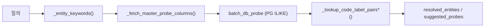
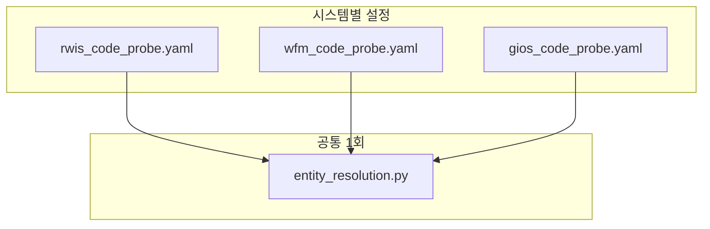

# Entity Resolution · Code Probe 설계 보고서

> **버전**: 2026-06-15  
> **대상 API**: `robo-meta-api` v0.7 `POST /data_decision`  
> **관련 문서**: [design-v4-resolved-entities.md](./design-v4-resolved-entities.md), [api_spec_v0.7.md](./api_spec_v0.7.md)

---

## 1. 배경 및 목적

`/data_decision` 응답의 `resolved_entities`는 자연어 질의에서 **시설·태그·변량·단위** 등을 DB 코드(`SUJ_CODE`, `tagsn`, `br_code` …)로 해소해, 하위 Text-to-SQL·필터 생성 단계에 넘기는 역할을 한다.

초기 구현(v0.7 A안)은 Neo4j Cypher로 probe 대상 컬럼을 수집했으나, **컬럼명에 `name`이 포함된 경우만** 후보에 올라가 정수장(`RDISAUP_TB.SUJ_NAME`) 위주로 동작했다.  
`탁도`, `NTU`, `태그` 등 질의는 키워드 추출까지는 되지만 **code 해소가 실패**하는 문제가 확인되었다.

본 보고서는 다음을 정리한다.

1. 현행 동작·한계
2. RWIS 코드성 사전 7테이블 기준 probe 설계 (GraphDB seed SQL 참조)
3. mart convention join_groups 묶임 이슈 및 조치
4. 멀티 시스템(RWIS / WFM / GIOS / HDAPS) 확장 전략
5. **A안(명시적 probe registry)** 구현 내용

---

## 2. 현행 Entity Resolution 파이프라인



| 단계 | 역할 | 비고 |
|------|------|------|
| 키워드 추출 | HyDE `entities.include` + 한글 토큰 + 정수장 패턴 분해 | 프롬프트 하드코딩 아님 |
| probe 컬럼 수집 | Neo4j: `subject_area ∈ {master,code}` + `*name*` 컬럼 | **병목** |
| db_probe | PG `ILIKE '%keyword%'` | `search_path` / 스키마 명시 |
| code 조회 | `code_col` + `label_col` 쌍 반환 | `rtrim(code::text)` |

### 2.1 실측 (변경 전)

| 질의 | `resolution_status` | 결과 |
|------|---------------------|------|
| `아산정수장에서 측정…` | `partial` | `SUJ_CODE` 354·928 해소 |
| `탁도 측정값` | `failed` | 해소 없음 |
| `유량 태그` | `failed` | 해소 없음 |

### 2.2 원인

- `RDITAG_TB.tag_desc`, `RDIBYUN_TB.br_name`, `RDITAGUNIT_TB.unit_desc` 등은 컬럼명에 `name`이 없어 Cypher에서 제외됨.
- `RDITAG_TB`, `RDIKEPCOTAG_TB`는 meta-ingest whitelist에 미포함 시 Neo4j에도 부재할 수 있음 (PG에는 존재).

---

## 3. RWIS 코드성 사전 7테이블 (GraphDB seed 기준)

출처: `K_Water_v1/oa_work/docker_part/data_pipeline/rwis_csv_to_mart/meta/seed/05_graphdb_meta_code_seed.sql`

논리 스키마 `code.*` → 물리 PG `RWIS.*` (대문자 테이블명).

| # | 논리 테이블 | PG 테이블 | 역할 | label (ILIKE) | code (PK) | entity_type |
|---|------------|-----------|------|---------------|-----------|-------------|
| 1 | `code.rditag_tb` | `RDITAG_TB` | 태그 마스터 | `tag_desc`, `tag_alias` | `tagsn` | `tag` |
| 2 | `code.rdisaup_tb` | `RDISAUP_TB` | 사업장 | `suj_name` | `suj_code` | `facility` |
| 3 | `code.rdibonbu_tb` | `RDIBONBU_TB` | 본부·권역 | `bnb_name` | `bnb_code` | `region` |
| 4 | `code.rdibyun_tb` | `RDIBYUN_TB` | 변량(탁도·유량…) | `br_name` | `br_code` | `metric` |
| 5 | `code.rditagunit_tb` | `RDITAGUNIT_TB` | 단위 | `unit_desc` | `tag_unit` | `unit` |
| 6 | `code.rdikepcotag_tb` | `RDIKEPCOTAG_TB` | 한전 태그 | `icus` | `tagsn` | `kepco_tag` |
| 7 | `code.rdikepcotype_tb` | `RDIKEPCOTYPE_TB` | 한전 항목 | `data_name` | `data_type` | `kepco_metric` |

### 3.1 질의 유형별 기대 해소

| 사용자 표현 예 | 해소 경로 |
|----------------|-----------|
| 아산정수장, 수지정수장 | `RDISAUP_TB.suj_name` → `suj_code` |
| 한강, 낙동강 | `RDIBONBU_TB.bnb_name` → `bnb_code` |
| 탁도, 잔류염소, 유량 | `RDIBYUN_TB.br_name` → `br_code` |
| NTU, mg/L | `RDITAGUNIT_TB.unit_desc` → `tag_unit` |
| (태그 설명 문구) | `RDITAG_TB.tag_desc` / `tag_alias` → `tagsn` |
| 계약전력, 역률 | `RDIKEPCOTYPE_TB.data_name` → `data_type` |

### 3.2 ingest 선행 조건

| 테이블 | `rwis_xlsx_tables.txt` (기준 시점) |
|--------|--------------------------------------|
| `rdisaup_tb` ~ `rdikepcotype_tb` (5건) | ✅ |
| **`rditag_tb`** | ❌ 추가 권장 |
| **`rdikepcotag_tb`** | ❌ 추가 권장 |

> **A안 probe는 PG 직접 조회**이므로 Neo4j ingest 없이도 code 해소 가능. 다만 `/meta/table`, vector 검색 품질을 위해 ingest 추가는 별도 권장.

---

## 4. join_groups · mart convention 조치

### 4.1 현상

mart fact 5테이블(`fct_measure_*`, `fct_kepco_15m`, `fct_tag_sunsi`)이 vector top-k에 함께 올라오면, **동일 컬럼명 convention bridge**(`tagsn`, `measure_value`, `suj_code` …)로 union-find가 한 그룹으로 묶여 `join_groups` 1건에 5테이블이 모두 포함되었다.

`DECISION_JOIN_EXPAND_VIA=fk`는 **최종 candidates 축소**에만 적용되며, join_groups 조립은 convention을 계속 사용한다.

### 4.2 조치 (적용 완료)

`fetch_convention_joins()`에서 **`fct_` prefix 테이블끼리** convention bridge 제외.

- mart ↔ mart: 제외
- mart ↔ RWIS 원천(`RDR01MI_*` 등): 유지 (`tagsn` bridge)

---

## 5. 멀티 시스템 확장 전략

향후 WFM, GIOS, HDAPS 등 datasource 추가 시:

| 구분 | RWIS (현재) | 타 시스템 추가 시 |
|------|-------------|------------------|
| probe **엔진** (keyword → code) | 1회 구현 | **재작업 없음** |
| probe **registry** (YAML) | `rwis_code_probe.yaml` | `wfm_code_probe.yaml` 등 **설정 1파일** |
| PG 연결 | 단일 pool | datasource별 pool / schema |
| Neo4j ingest | RWIS whitelist | 시스템별 whitelist |



환경변수 `ENTITY_PROBE_DATASOURCE=rwis` 로 registry 파일 선택.

**중기(B안)**: GraphDB `t2s_columns.metadata.text_search` 를 Neo4j에 동기화하면 Cypher 단일 쿼리로 통합 가능.

---

## 6. A안 구현 — 명시적 Probe Registry

### 6.1 설계 요약

- 파일: `app/rules/rwis_code_probe.yaml`
- 로더: `app/services/entity_probe_registry.py`
- `_fetch_master_probe_columns()` Neo4j Cypher **대체** → YAML 기반 `ColumnCandidate` 생성
- `code_column`, `entity_type`을 registry에서 직접 지정 (추측 `_guess_code_column` 제거)

### 6.2 YAML 구조

```yaml
datasource: rwis
pg_schema: RWIS
neo4j_schema: rwis

probes:
  - table: RDIBYUN_TB
    entity_type: metric
    code_column: br_code
    label_columns: [br_name]
```

### 6.3 PG 스키마·컬럼 매핑

| 테이블 패턴 | PG schema |
|------------|-----------|
| `fct_*` | `mart` |
| 그 외 코드 테이블 | `RWIS` (`SOURCE_PG_SCHEMA`) |

- **컬럼명**: PG 물리 컬럼은 대문자(`SUJ_NAME`, `BR_NAME` …) — registry YAML도 대문자로 기재.
- **공백 정규화**: `RDIBYUN_TB.BR_NAME` 등 DB 값이 `탁 도`(공백 포함)인 경우, probe/lookup SQL에서 `replace(col,' ','')` 로 `탁도` 키워드 매칭.
- **영문 키워드**: `NTU`, `mg/L` 등 Latin 토큰도 `_entity_keywords()` 추출 대상.

### 6.4 응답 `entity_type` 확장

| registry 값 | 의미 |
|-------------|------|
| `facility` | 사업장·정수장 |
| `region` | 본부·권역 |
| `metric` | 변량·지표 |
| `unit` | 측정 단위 |
| `tag` | RWIS 태그 |
| `kepco_tag` | 한전 태그 |
| `kepco_metric` | 한전 항목 |
| `code` | 기타 코드 |

### 6.5 환경변수

| 변수 | 기본값 | 설명 |
|------|--------|------|
| `ENTITY_PROBE_DATASOURCE` | `rwis` | `app/rules/{datasource}_code_probe.yaml` |
| `ENTITY_RESOLUTION_ENABLED` | `1` | entity resolution on/off |
| `SOURCE_PG_SCHEMA` | `RWIS` | 코드 테이블 PG schema |

---

## 7. Swagger example · table description

- 런타임 `/data_decision` 응답에는 `table_comment`, `description` 포함됨.
- Swagger Successful Response example만 null이었던 것은 **문서 UX 이슈** (API 동작 문제 아님).
- `DecisionCandidate.model_config.json_schema_extra.examples` 보강으로 `/docs` 샘플 반영.

---

## 8. 검증 시나리오

| # | 질의 | 기대 |
|---|------|------|
| 1 | `아산정수장에서 측정…` | `partial`, `suj_code` 354·928 |
| 2 | `탁도 측정값` | `RDIBYUN_TB.br_name` → `br_code` |
| 3 | `NTU 단위` | `RDITAGUNIT_TB.unit_desc` → `tag_unit` |
| 4 | mart 후보만 top-k | `join_groups`에 mart끼리 묶임 없음 |

---

## 9. 후속 작업

1. **meta-ingest**: `rditag_tb`, `rdikepcotag_tb` whitelist 추가 및 Neo4j 재적재
2. **WFM/GIOS**: `{datasource}_code_probe.yaml` 추가 + `ENTITY_PROBE_DATASOURCE` 전환
3. **B안**: Neo4j Column `text_search` 메타 기반 동적 probe (ingest 파이프라인 연동)
4. **질의 스코프**: vector 후보 `datasource`와 probe registry 자동 매칭

---

## 10. 변경 파일 목록 (A안)

| 파일 | 변경 |
|------|------|
| `app/rules/rwis_code_probe.yaml` | 신규 — 7테이블 probe 스펙 |
| `app/services/entity_probe_registry.py` | 신규 — YAML 로더 |
| `app/services/entity_resolution.py` | registry 기반 probe |
| `app/schemas.py` | `entity_type` Literal 확장 |
| `app/config.py` | `ENTITY_PROBE_DATASOURCE` |
| `.env.example` | 환경변수 문서화 |
| `tests/test_entity_probe_registry.py` | 신규 — 단위 테스트 |
